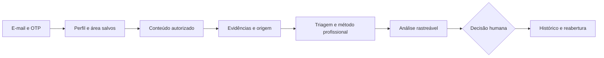

# RAVEN — visão técnica de alto nível

[Apresentação](CAMADA_RAVEN.md). Documento de arquitetura segura para conhecer o produto, sem expor implementação, heurísticas, pesos ou infraestrutura sensível.

## Fluxo atual

## Camadas

| Camada | Responsabilidade |
|---|---|
| Interface web | Recebe conteúdo, apresenta limites e permite decisão humana. |
| API | Valida a entrada/sessão e conecta interface, motor e estado salvo. |
| Método profissional | Usa QA, SEC, NET/NOC, INF, SRE ou SUP, com investigação relevante ao caso. |
| Contrato de evidências | Mantém origem, suporte, inferências, hipótese, lacunas e justificativa. |
| Persistência | Guarda área do caso, entrada, resultado e decisão associados à conta. |

Nome opcional e área são preferências da conta verificada. Alterar preferência orienta novas análises e não reescreve casos antigos. O responsável pela decisão é registrado separadamente; nome de exibição não comprova identidade.

## Entrada e resposta

Texto e ficheiros textuais suportados (TXT/LOG/JSON/CSV) seguem o mesmo motor. O fluxo limita texto combinado a8192caracteres e ficheiro a256KB. PNG/JPG válidos são anexos de revisão humana; conteúdo visual não é interpretado automaticamente.

Fatos relatados, inferências e hipótese não são equivalentes. A análise deve apontar origem, evidência faltante e como confirmar. Confiança no contexto é distinta da certeza da causa. Sem impacto sustentado, gravidade/prioridade permanecem a determinar.

A interface mantém uma leitura curta; suporte detalhado fica expansível. Ações indicam objetivo, ferramenta e evidência a obter. **Aprovar/Ajustar/Rejeitar** registra decisão; não executa ferramentas, não fecha chamados externos e não comprova resolução.

## Segurança e limites

Sessão autenticada, consentimento, isolamento de conta e mascaramento conhecido são parte do fluxo. Entradas são dados não confiáveis, não comandos de sistema. O usuário deve revisar segredos/dados pessoais antes do envio; mascaramento não elimina essa responsabilidade.

Histórico permite compreender e reabrir um caso. Não anunciar aprendizagem automática ou aproveitamento dos dados após exclusão. Não há capacidade simultânea comprovada por teste de carga; manter piloto pequeno acompanhado.

## Fronteira pública

É compartilhável: propósito, fluxo, entradas/saídas, responsabilidades de alto nível, limites e decisão humana.

Permanece privado: código ativo, heurísticas, pesos, regras detalhadas, credenciais, dados de contas, provas de conta real e configuração sensível. Licenciamento do código não é alterado por este documento.
